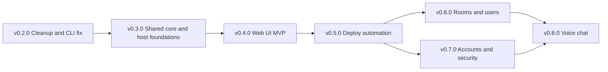

# Hermes Release Roadmap

Hermes is a private messenger for a small group of friends, reachable over the
local network and Tailscale. It is two repositories: `hermes-be`, a single Node
process with Fastify, a raw WebSocket channel and SQLite via `better-sqlite3`
with no ORM; and `hermes-fe`, today a TypeScript readline CLI, which grows a web
UI over the course of this plan.

This file is the source of truth for release scope. It covers v0.2.0 through
v0.8.0. GitHub issues in both repos are grouped with `release:vX.Y.Z` labels and
should trace back to a bullet here. When scope moves between releases, it moves
here first.

Architecture decisions live in [adr/](adr/):

- [0001 Frontend stack](adr/0001-frontend-stack.md) - SvelteKit with
  `adapter-static`, chosen over React and Vite.
- [0002 Deployment topology](adr/0002-deployment-topology.md) - one self-hosted
  runner on `ying-1`, release-published deploys, public-repo hardening.

## Decisions locked in

**Web UI stack.** SvelteKit with `adapter-static` (SPA, no SSR). Keeps the
Bearer-token auth model untouched and lets hermes-be serve the built assets from
a single origin, so there is no CORS and no second process to supervise. See ADR
0001.

**Repo layout.** An npm workspaces monorepo inside `hermes-fe`, with
`packages/core`, `apps/cli` and `apps/web`. The CLI keeps working throughout.

**Deploy trigger.** Published releases, plus a `workflow_dispatch` button taking
a tag as input for redeploys and rollbacks. Pushing a tag does not deploy; only
publishing a GitHub Release fires `release: published`. Pushing to `main` stays
safe, and deploying is a deliberate act from any device. `workflow_dispatch` is
restricted to accounts with write access, so it does not widen the attack
surface.

**Deploy topology.** One self-hosted GitHub Actions runner on `ying-1`,
registered to hermes-be. It polls GitHub over outbound HTTPS, so a release
published from any device triggers a deploy with no inbound access to the host,
no tailnet path from GitHub, and no credentials on the pushing device. hermes-fe
builds its static bundle on a GitHub-hosted runner and publishes it as a release
asset, so only one self-hosted runner exists. See ADR 0002.

**Split rollout.** The host becomes a real systemd service with a manual
`deploy.sh` in v0.3.0, and that script gets wired into CI in v0.5.0. The deploy
logic is written once; CI only gains the trigger, the artifact fetch and the
rollback.

**Repos stay public.** Private would not help integration or publishing, and
would actively cost a PAT for the cross-repo artifact fetch plus the Actions
minutes quota. The fork-PR risk it would have closed is instead closed by
requiring approval for all outside collaborators' workflows in Settings, Actions,
General.

**Environments.** A template systemd unit `hermes-be@.service` with per-instance
environment files from the start, but only `p1` running initially. Data lives
under `/var/lib/hermes/<instance>/` and checkouts under
`/srv/hermes/<instance>/`. Standing up `s1` later is one env file and one
`systemctl enable`, not a refactor. `s1` gets created just before the v0.6.0
membership migration, which is the one change risky enough to justify a
rehearsal.

**Issues.** Filed in both repos, split by where the work lives, grouped with
`release:vX.Y.Z` labels.

## Three prerequisites the milestone list did not mention

### Dev workspace and production instance must stop being the same directory

`ying-1` is this machine (`hostname` is `YING`, and `hermes-fe/src/cli.ts`
already defaults to `http://ying-1:3000`). Today the live database sits at
`data/hermes.db` inside the editable checkout at `/home/ai/Workspace/hermes-be`.
Once this box is the host, a deploy that touches the working tree is destructive
and an errant `npm test` can clobber real data. v0.3.0 introduces a `hermes`
service user, a production checkout under `/srv/hermes/p1/hermes-be`, and data
under `/var/lib/hermes/p1/` (`HERMES_DB_PATH`, `HERMES_FILES_DIR`,
`HERMES_WEB_DIR`), with a documented one-time copy of the existing database and
files.

### Untracked backend WIP must be resolved first

`src/rooms.ts` defines a group/DM room model keyed by `room_id`/`user_id` foreign
keys, which directly conflicts with the committed slug-and-username
`room_members` table in `src/schema.ts`. It is not wired into `src/app.ts`.
`src/integration.test.ts` is really a specification for endpoints that do not
exist (`GET /users`, `POST /rooms`, `POST /rooms/dm`, `POST /auth/logout`, WS
`typing` and `presence`), and it broke `npm test` because it matched the
`src/*.test.ts` glob but expected a live server on port 3456. Resolved in
v0.2.0: `rooms.ts` and `rooms.test.ts` are parked on the `feat/rooms-dm` branch
and land properly in v0.6.0 with a real migration; the integration script moved
to `test/integration/integration.spec.ts` behind its own npm script.

### Server-side sessions must land with client-side token storage

Tokens live in an in-memory `Map` in `createApp()`, so every restart logs
everyone out. v0.3.0 gives the CLI a persistent token store and v0.4.0 puts the
web token in `localStorage`; a persisted client token is worthless if the server
forgets it on restart, and produces confusing 401s instead of a clean login
prompt. Restarts also stop being rare once the host is a service. So the
sessions table ships in v0.3.0, ahead of the rest of the auth hardening.

## Why this order

The password bugfix goes in v0.2.0 rather than being squeezed anywhere, because
it needs a real rewrite rather than a one-liner. The shared-core extraction is
its own release because it is roughly 60 percent of the migration effort and is
framework-agnostic, so it can be reviewed and shipped with zero UI risk and the
CLI still working; it runs in parallel with the backend host work, which is in a
different repo. Full deploy automation waits until v0.5.0 so it is built once
already knowing it must ship both a Node service and a static bundle, but the
underlying service and script land in v0.3.0 so the gap is one SSH command
rather than a manual build. Rooms/DMs and accounts both land after automation
because both are far more valuable with a UI to drive them and a one-tag deploy
to try them on; they are independent of each other, so their order is
interchangeable. Voice chat is last because it needs both a UI and the hardened
auth.

## v0.2.0 - Cleanup and CLI fix

- Rewrite `questionPassword` in `hermes-fe/src/terminal.ts`. The current
  implementation overrides the string-keyed `Interface.prototype._writeToOutput`,
  but Node 18.19 calls the symbol-keyed method internally (`_insertString` calls
  `this[kWriteToOutput](c)`), and the public name is only an alias of it, so the
  override never runs. Replace the internals hook with explicit keypress
  handling: `rl.pause()`, `input.setRawMode(true)`, collect bytes until CR/LF,
  echo nothing (or `*`), handle backspace `0x7f` and Ctrl-C `0x03`, then restore
  raw mode and `rl.resume()`. Take `input`/`output` as parameters so it is
  unit-testable with a `PassThrough`.
- Fix `npm test` in hermes-be: narrow the test glob or convert
  `integration.test.ts` into a `node:test` file that boots its own app.
- Move `rooms.ts` and `rooms.test.ts` onto a `feat/rooms-dm` branch so the
  release branch is clean.
- Add `.github/` to both repos: issue and PR templates, plus a CI workflow
  running `npm test` on push and pull request, pinned to `ubuntu-latest`. These
  must never move to the self-hosted runner added in v0.5.0, since both repos
  are public.
- Write a real `hermes-fe/README.md` (currently one line) covering install,
  `HERMES_BASE_URL`, and the slash commands from `printHelp()`.
- Create `docs/ROADMAP.md` in hermes-be as the single tracker, plus
  `docs/adr/0001-frontend-stack.md` recording the SvelteKit choice against the
  React comparison, and `docs/adr/0002-deployment-topology.md` recording the
  self-hosted runner, the tag-only trigger, and the public-repo runner hardening
  rules.
- Tag `v0.2.0` in both repos.

## v0.3.0 - Shared core and host foundations

Two independent tracks in two repos; they can proceed in either order.

### Track A - hermes-fe shared core (no UI yet)

- Convert hermes-fe to npm workspaces: `packages/core`, `apps/cli`.
- Move `types.ts`, `api.ts`, `ws.ts` and `commands.ts` into `packages/core`.
  These are already UI-free.
- Extract a session controller out of the 600-line `cli.ts`. The logic worth
  sharing is `resolveRoom()`, the `displayedMessageIds` dedup, `handlePresence()`
  and the roster helpers, the socket handler routing, and reconnect-then-rejoin.
  It emits events; the UI subscribes.
- Define three platform adapters so core runs in Node and the browser: transport
  (`ws` package vs native `WebSocket`), file IO (`fs/promises` vs `File`/`Blob`
  — `api.uploadFile` currently imports `node:fs`), and token storage (config
  file for the CLI vs `localStorage` for the web).
- Reduce `apps/cli` to `terminal.ts` plus a thin render loop. Behavior must be
  unchanged apart from staying logged in across restarts.
- Add core tests. Today only `commands.test.ts` exists, covering `parseChatLine`
  alone.
- Add a `bin` field so `hermes` installs as a global command.

### Track B - hermes-be host foundations

- Persist sessions in SQLite (a `sessions` table with token, username,
  created_at, expires_at) and validate against it instead of the in-memory
  `Map`.
- Consolidate the database handle: `src/auth.ts` opens its own `better-sqlite3`
  connection separate from `src/db.ts`, and `users` is created outside
  `schema.ts`. Move all table creation into `migrateSchema()`.
- Create the `hermes` service user, the `/srv/hermes/p1/hermes-be` production
  checkout, and `/var/lib/hermes/p1/{hermes.db,files}`. Copy the existing
  workspace database and files over once, and confirm the dev workspace now
  points somewhere else.
- Add a **template** systemd unit `hermes-be@.service`, enabled at boot as
  `hermes-be@p1`, reading `/etc/hermes/%i.env` for `PORT`, `HERMES_DB_PATH`,
  `HERMES_FILES_DIR`, `HERMES_WEB_DIR`. Only `p1` exists for now; the template is
  what makes `s1` cheap later.
- `deploy.sh` takes the instance as its first argument so the same script serves
  `p1` and any future `s1`.
- Extend `/health` with version and git commit so a deploy can be verified.
- Add `scripts/deploy.sh`, runnable by hand over SSH: fetch a given tag,
  `npm ci`, `npm run build`, run migrations, `systemctl restart hermes-be`, poll
  `/health` for the expected version.
- Write `docs/DEPLOY.md` covering the manual runbook and the one-time host
  setup.
- Enable Fastify's Pino logger: `LOG_LEVEL` from the environment, JSON to
  stdout for journald, `pino-pretty` as a local-dev-only dependency (TTY
  stdout only), request ids, error serialization for unhandled route errors
  and WebSocket errors, and redaction of the `Authorization` header, the
  `token` query parameter, and any `password` field. Never log message content
  or file contents. Emit domain events for login success/failure, WebSocket
  connect/disconnect (including 401), room join, file upload (id, uploader,
  size, MIME), and each `migrateSchema()` step including no-ops. Document log
  access in `docs/DEPLOY.md`.

## v0.4.0 - Web UI MVP

- `apps/web`: SvelteKit with `adapter-static`, consuming `packages/core`.
- Screens: login and register (native `input type="password"`), room list,
  message history with a virtualized list, composer, presence sidebar,
  connection status indicator.
- File upload and download through the browser File API against the existing
  `POST /files` and `GET /files/:id`.
- Token in `localStorage` via the v0.3.0 storage adapter; handle the WS 401 and
  reconnect paths already modelled in `ws.ts`.
- Derive the API base URL from `window.location.origin` rather than baking it in
  at build time. The bundle is served same-origin, so one artifact then works
  unmodified against `p1` or a future `s1` on a different port.
- Backend: an `@fastify/static` mount on `HERMES_WEB_DIR` that is a no-op when
  unset, so the bundle is served from the same origin as the API.
- Extend `deploy.sh` to unpack a web bundle into `HERMES_WEB_DIR`, still invoked
  manually.
- Tag `v0.4.0`. This is the first release where hermes-fe ships two artifacts
  from one repo.

## v0.5.0 - Deploy automation

- Register a self-hosted runner on `ying-1` via `svc.sh install` so it starts at
  boot and a release published from a laptop is picked up even with nobody
  logged in. Add a narrow sudoers rule permitting only
  `systemctl restart hermes-be` and `systemctl status hermes-be` without a
  password.
- hermes-fe workflow on published release: build `apps/web` on a GitHub-hosted
  runner and upload `build/` as a release asset.
- hermes-be workflow on published release, on the self-hosted runner: check out
  the tag into `/srv/hermes`, download the matching hermes-fe web asset, then
  call the existing `deploy.sh`. Both repos are public, so the release asset is
  fetchable with the default `GITHUB_TOKEN` and no cross-repo PAT secret is
  needed.
- Harden the runner, because a self-hosted runner on a **public** repo is the one
  genuinely risky part of this design: without care, anyone can open a pull
  request whose workflow executes arbitrary code on `ying-1`. Mitigations, in
  order of importance: never attach a `pull_request` trigger to the self-hosted
  runner (the `release: published` trigger cannot be fired from a fork); pin
  every test and build workflow to `ubuntu-latest`; set Actions to require
  approval for all outside collaborators' fork PRs; keep the sudoers rule to the
  two `systemctl` verbs so a compromise cannot trivially escalate. Making the
  repos private removes the vector entirely if that is acceptable.
- Add a `workflow_dispatch` trigger to the hermes-be workflow with a required
  `tag` input, so any released version can be redeployed or rolled back from the
  Actions tab without deleting and recreating a Release. Editing an
  already-published Release does not re-fire `published`, which is why this
  button is worth having.
- Have `deploy.sh` retry the web-asset download with a short backoff. Because the
  two repos release independently, the hermes-fe bundle may still be uploading
  when the hermes-be deploy starts.
- Add rollback to `deploy.sh`: if the `/health` version poll fails, redeploy the
  previous tag, including the web asset pinned to that tag, so backend and
  frontend never diverge.
- Extend `docs/DEPLOY.md` with runner setup, the release-day ordering rule
  (publish the hermes-fe release first, let its bundle upload, then publish
  hermes-be), how to use the dispatch button, and how to force a rollback.

## v0.6.0 - Rooms and users

- Stand up the `s1` instance first: one env file, `/var/lib/hermes/s1/` seeded
  from a copy of `p1`'s database and files, `systemctl enable hermes-be@s1`.
  Rehearse the migration there and verify existing history survives before
  touching `p1`.
- Take a manual copy of `p1`'s `hermes.db` immediately before the production
  migration run. There is no automated backup in `deploy.sh` by choice, so this
  in-place rewrite of live message history is the one moment that needs a
  deliberate one.
- Land the `feat/rooms-dm` branch: group rooms and DMs with membership by
  `user_id`, plus a real migration from the slug-and-username `room_members` to
  the FK model, including a backfill for existing rows.
- New endpoints: `GET /users`, `GET /users/online`, `POST /rooms`,
  `POST /rooms/dm`, `POST /auth/logout`.
- Web UI: create a room, start a DM, browse users.
- Make `integration.spec.ts` pass for real against the implemented surface, and
  fold it back into the default test run.

## v0.7.0 - Accounts and security

- Replace the unsalted SHA256 in `hashPassword()` with argon2id, rehashing each
  user transparently on their next successful login.
- Profile page: view and edit account details, change password with
  current-password confirmation.
- Avatar upload reusing the existing files infrastructure.
- Rate limiting on the auth endpoints.
- Open question on password reset: with no email infrastructure there is no
  self-service reset. Options are an admin-issued one-time reset token, a
  recovery code generated at registration, or adding SMTP. Worth deciding when we
  get here; the profile page covers the common case in the meantime.

## v0.8.0 - Voice chat

- WebRTC signaling over the existing `/ws` channel with new message types
  (`call_offer`, `call_answer`, `ice_candidate`, `call_end`), reusing handshake
  auth.
- Peer-to-peer mesh for small groups. Media is DTLS-SRTP encrypted between peers
  and never traverses the server, which gives genuine end-to-end encryption. An
  SFU would break that property, so mesh is the right call at this group size.
- Call UI: join, leave, mute, participant list, speaking indicator.
- Direct connections usually work on a tailnet; add STUN and only stand up
  coturn if testing shows it is needed.
- Browser only. CLI voice is explicitly out of scope.
