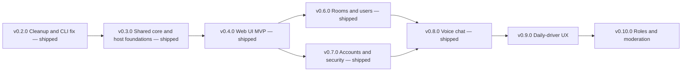

# Hermes Release Roadmap

Hermes is a private messenger for a small group of friends, reachable over the
local network and Tailscale. It is two repositories: `hermes-be`, a single Node
process with Fastify, a raw WebSocket channel and SQLite via `better-sqlite3`
with no ORM; and `hermes-fe`, an npm workspaces monorepo with `@hermes/core`, a
TypeScript readline CLI, and a static SvelteKit web UI served by hermes-be.

This file is the source of truth for release scope. It covers v0.2.0 through
v0.10.0. GitHub issues in both repos are grouped with `release:vX.Y.Z` labels, or
`backlog` when they have no target release, and should trace back to a bullet
here. When scope moves between releases, it moves here first.

Architecture decisions live in [adr/](adr/):

- [0001 Frontend stack](adr/0001-frontend-stack.md) - SvelteKit with
  `adapter-static`, chosen over React and Vite.
- [0002 Deployment topology](adr/0002-deployment-topology.md) - template systemd
  unit and manual `deploy.sh` (shipped). CI wiring via a self-hosted runner is
  backlog, blocked on making hermes-be private.

## Status

- [x] v0.2.0 - Cleanup and CLI fix
- [x] v0.3.0 - Shared core and host foundations
- [x] v0.4.0 - Web UI MVP
- [x] v0.6.0 - Rooms and users (shipped on `p1`; `s1` rehearsal skipped)
- [x] v0.7.0 - Accounts and security (live on `p1`)
- [x] v0.8.0 - Voice chat (live on `p1`; HTTPS via Tailscale Serve)
- [ ] v0.9.0 - Daily-driver UX (current)
- [ ] v0.10.0 - Roles and moderation
- [ ] Deploy automation (backlog, was v0.5.0; blocked on [be#35](https://github.com/ahyibrahim/hermes-be/issues/35))

## Decisions locked in

**Web UI stack.** SvelteKit with `adapter-static` (SPA, no SSR). Keeps the
Bearer-token auth model untouched and lets hermes-be serve the built assets from
a single origin, so there is no CORS and no second process to supervise. See ADR
0001.

**Repo layout.** An npm workspaces monorepo inside `hermes-fe`, with
`packages/core`, `apps/cli` and `apps/web`. The CLI keeps working throughout.

**Deploy path (now).** Manual `scripts/deploy.sh` on ying-1. Pushing a git tag
does not deploy. See [docs/DEPLOY.md](DEPLOY.md).

**Deploy automation (backlog).** A self-hosted runner on ying-1, fired by
publishing a GitHub Release, calling that same `deploy.sh`. Deferred: a runner
on a public repo is a path for a fork pull request to execute code next to the
live database. That work is blocked on making hermes-be private
([be#35](https://github.com/ahyibrahim/hermes-be/issues/35)). See ADR 0002.

**Split rollout.** The host became a systemd service with a manual `deploy.sh`
in v0.3.0. Wiring that script into CI is unscheduled, not the next release.

**Repos stay public until be#35.** ADR 0002 originally kept them public and
closed the fork-PR vector with workflow discipline. That is reversed as a
precondition for any self-hosted runner: hermes-be becomes private first.
hermes-fe can stay public (GitHub-hosted builds only).

**Environments.** A template systemd unit `hermes-be@.service` with per-instance
environment files from the start, but only `p1` running initially. Data lives
under `/var/lib/hermes/<instance>/` and checkouts under
`/srv/hermes/<instance>/`. Standing up `s1` is one env file and one
`systemctl enable`, not a refactor. The v0.6.0 membership rewrite is the change
that justified a rehearsal path; that release went to `p1` without standing up
`s1` ([be#21](https://github.com/ahyibrahim/hermes-be/issues/21) skipped). `s1`
remains the documented path for a future in-place rewrite (see
[docs/DEPLOY.md](DEPLOY.md#v060-s1-rehearsal-and-p1-backup)).

**Issues.** Filed in both repos, split by where the work lives, grouped with
`release:vX.Y.Z` or `backlog`.

## Three prerequisites the milestone list did not mention

### Dev workspace and production instance must stop being the same directory

`ying-1` is this machine (`hostname` is `YING`, and `hermes-fe/src/cli.ts`
already defaults to `http://ying-1:3000`). Today the live database sits at
`data/hermes.db` inside the editable checkout at `/home/ai/Workspace/hermes-be`.
Once this box is the host, a deploy that touches the working tree is destructive
and an errant `npm test` can clobber real data. v0.3.0 introduces a `hermes`
service user, a production checkout under `/srv/hermes/p1/hermes-be`, and data
under `/var/lib/hermes/p1/` (`HERMES_DB_PATH`, `HERMES_FILES_DIR`,
`HERMES_WEB_DIR`), with a documented one-time copy of the existing database and
files.

### Untracked backend WIP (resolved in v0.6.0)

`src/rooms.ts` defined a group/DM room model keyed by `room_id`/`user_id` foreign
keys, which conflicted with the slug-and-username `room_members` table. It was
parked on `feat/rooms-dm`, then reimplemented against current `main` in v0.6.0
with a real migration. The old live-server integration spec moved to
`test/integration/integration.spec.ts` and the v0.6.0 contract now runs in
`src/v06-api.test.ts` as part of `npm test`.

### Server-side sessions must land with client-side token storage

Tokens live in an in-memory `Map` in `createApp()`, so every restart logs
everyone out. v0.3.0 gives the CLI a persistent token store and v0.4.0 puts the
web token in `localStorage`; a persisted client token is worthless if the server
forgets it on restart, and produces confusing 401s instead of a clean login
prompt. Restarts also stop being rare once the host is a service. So the
sessions table ships in v0.3.0, ahead of the rest of the auth hardening.

## Why this order

The password bugfix goes in v0.2.0 rather than being squeezed anywhere, because
it needs a real rewrite rather than a one-liner. The shared-core extraction is
its own release because it is roughly 60 percent of the migration effort and is
framework-agnostic, so it can be reviewed and shipped with zero UI risk and the
CLI still working; it runs in parallel with the backend host work, which is in a
different repo. Deploy automation was planned as v0.5.0 so it would be built
once already knowing it must ship both a Node service and a static bundle; the
underlying service and script landed in v0.3.0, and the CI wiring is now
backlog (blocked on a private hermes-be) rather than a gate for rooms or
accounts. Rooms/DMs and accounts are independent of each other and of
automation — they still want a UI, which v0.4.0 shipped. Voice chat needed
both a UI and the hardened auth. Daily-driver UX follows voice because the
shell is now the product. Roles and destructive ops wait until that shell
exists, and until `users.role` is more than a label.

## v0.2.0 - Cleanup and CLI fix

- Rewrite `questionPassword` in `hermes-fe/src/terminal.ts`. The current
  implementation overrides the string-keyed `Interface.prototype._writeToOutput`,
  but Node 18.19 calls the symbol-keyed method internally (`_insertString` calls
  `this[kWriteToOutput](c)`), and the public name is only an alias of it, so the
  override never runs. Replace the internals hook with explicit keypress
  handling: `rl.pause()`, `input.setRawMode(true)`, collect bytes until CR/LF,
  echo nothing (or `*`), handle backspace `0x7f` and Ctrl-C `0x03`, then restore
  raw mode and `rl.resume()`. Take `input`/`output` as parameters so it is
  unit-testable with a `PassThrough`.
- Fix `npm test` in hermes-be: narrow the test glob or convert
  `integration.test.ts` into a `node:test` file that boots its own app.
- Move `rooms.ts` and `rooms.test.ts` onto a `feat/rooms-dm` branch so the
  release branch is clean.
- Add `.github/` to both repos: issue and PR templates, plus a CI workflow
  running `npm test` on push and pull request, pinned to `ubuntu-latest`. These
  must never move to a self-hosted runner while the repo is public.
- Write a real `hermes-fe/README.md` (currently one line) covering install,
  `HERMES_BASE_URL`, and the slash commands from `printHelp()`.
- Create `docs/ROADMAP.md` in hermes-be as the single tracker, plus
  `docs/adr/0001-frontend-stack.md` recording the SvelteKit choice against the
  React comparison, and `docs/adr/0002-deployment-topology.md` recording the
  self-hosted runner, the tag-only trigger, and the public-repo runner hardening
  rules.
- Tag `v0.2.0` in both repos.

## v0.3.0 - Shared core and host foundations

Two independent tracks in two repos; they can proceed in either order.

### Track A - hermes-fe shared core (no UI yet)

- Convert hermes-fe to npm workspaces: `packages/core`, `apps/cli`.
- Move `types.ts`, `api.ts`, `ws.ts` and `commands.ts` into `packages/core`.
  These are already UI-free.
- Extract a session controller out of the 600-line `cli.ts`. The logic worth
  sharing is `resolveRoom()`, the `displayedMessageIds` dedup, `handlePresence()`
  and the roster helpers, the socket handler routing, and reconnect-then-rejoin.
  It emits events; the UI subscribes.
- Define three platform adapters so core runs in Node and the browser: transport
  (`ws` package vs native `WebSocket`), file IO (`fs/promises` vs `File`/`Blob`
  — `api.uploadFile` currently imports `node:fs`), and token storage (config
  file for the CLI vs `localStorage` for the web).
- Reduce `apps/cli` to `terminal.ts` plus a thin render loop. Behavior must be
  unchanged apart from staying logged in across restarts.
- Add core tests. Today only `commands.test.ts` exists, covering `parseChatLine`
  alone.
- Add a `bin` field so `hermes` installs as a global command.

### Track B - hermes-be host foundations

- Persist sessions in SQLite (a `sessions` table with token, username,
  created_at, expires_at) and validate against it instead of the in-memory
  `Map`.
- Consolidate the database handle: `src/auth.ts` opens its own `better-sqlite3`
  connection separate from `src/db.ts`, and `users` is created outside
  `schema.ts`. Move all table creation into `migrateSchema()`.
- Create the `hermes` service user, the `/srv/hermes/p1/hermes-be` production
  checkout, and `/var/lib/hermes/p1/{hermes.db,files}`. Copy the existing
  workspace database and files over once, and confirm the dev workspace now
  points somewhere else.
- Add a **template** systemd unit `hermes-be@.service`, enabled at boot as
  `hermes-be@p1`, reading `/etc/hermes/%i.env` for `PORT`, `HERMES_DB_PATH`,
  `HERMES_FILES_DIR`, `HERMES_WEB_DIR`. Only `p1` exists for now; the template is
  what makes `s1` cheap later.
- `deploy.sh` takes the instance as its first argument so the same script serves
  `p1` and any future `s1`.
- Extend `/health` with version and git commit so a deploy can be verified.
- Add `scripts/deploy.sh`, runnable by hand over SSH: fetch a given tag,
  `npm ci`, `npm run build`, run migrations, `systemctl restart hermes-be`, poll
  `/health` for the expected version.
- Write `docs/DEPLOY.md` covering the manual runbook and the one-time host
  setup.
- Enable Fastify's Pino logger: `LOG_LEVEL` from the environment, JSON to
  stdout for journald, `pino-pretty` as a local-dev-only dependency (TTY
  stdout only), request ids, error serialization for unhandled route errors
  and WebSocket errors, and redaction of the `Authorization` header, the
  `token` query parameter, and any `password` field. Never log message content
  or file contents. Emit domain events for login success/failure, WebSocket
  connect/disconnect (including 401), room join, file upload (id, uploader,
  size, MIME), and each `migrateSchema()` step including no-ops. Document log
  access in `docs/DEPLOY.md`.

## v0.4.0 - Web UI MVP

- `apps/web`: SvelteKit with `adapter-static`, consuming `packages/core`.
- Screens: login and register (native `input type="password"`), room list,
  message history with a virtualized list, composer, presence sidebar,
  connection status indicator.
- File upload and download through the browser File API against the existing
  `POST /files` and `GET /files/:id`.
- Token in `localStorage` via the v0.3.0 storage adapter; handle the WS 401 and
  reconnect paths already modelled in `ws.ts`.
- Derive the API base URL from `window.location.origin` rather than baking it in
  at build time. The bundle is served same-origin, so one artifact then works
  unmodified against `p1` or a future `s1` on a different port.
- Backend: an `@fastify/static` mount on `HERMES_WEB_DIR` that is a no-op when
  unset, so the bundle is served from the same origin as the API. Shipped in
  v0.4.0.
- Extend `deploy.sh` to unpack a web bundle into `HERMES_WEB_DIR`, still invoked
  manually. Shipped in v0.4.0.
- Tag `v0.4.0`. This is the first release where hermes-fe ships two artifacts
  from one repo.

## Deploy automation (backlog, was v0.5.0)

Unscheduled. Blocked on making hermes-be private
([be#35](https://github.com/ahyibrahim/hermes-be/issues/35)). Do not install a
runner or add `runs-on: self-hosted` until that issue is closed. Manual
`deploy.sh` remains the production path. Issues: be#15–#20, fe#16.

- Register a self-hosted runner on `ying-1` via `svc.sh install` so it starts at
  boot and a release published from a laptop is picked up even with nobody
  logged in. Add a narrow sudoers rule permitting only
  `systemctl restart hermes-be` and `systemctl status hermes-be` without a
  password.
- hermes-fe workflow on published release: build `apps/web` on a GitHub-hosted
  runner and upload `build/` as a release asset.
- hermes-be workflow on published release, on the self-hosted runner: check out
  the tag into `/srv/hermes`, download the matching hermes-fe web asset, then
  call the existing `deploy.sh`. With hermes-be private and hermes-fe public,
  the default `GITHUB_TOKEN` can still fetch that asset; both-private would
  need a PAT.
- Keep runner hardening even after the repo is private: never attach a
  `pull_request` trigger to the self-hosted runner; pin test/build workflows
  to `ubuntu-latest`; keep sudoers to the two `systemctl` verbs.
- Add a `workflow_dispatch` trigger to the hermes-be workflow with a required
  `tag` input, so any released version can be redeployed or rolled back from the
  Actions tab without deleting and recreating a Release. Editing an
  already-published Release does not re-fire `published`, which is why this
  button is worth having.
- Have `deploy.sh` retry the web-asset download with a short backoff. Because the
  two repos release independently, the hermes-fe bundle may still be uploading
  when the hermes-be deploy starts.
- Add rollback to `deploy.sh`: if the `/health` version poll fails, redeploy the
  previous tag, including the web asset pinned to that tag, so backend and
  frontend never diverge.
- Extend `docs/DEPLOY.md` with runner setup, the release-day ordering rule
  (publish the hermes-fe release first, let its bundle upload, then publish
  hermes-be), how to use the dispatch button, and how to force a rollback.

## v0.6.0 - Rooms and users (shipped)

Done. Was live on `p1`; superseded by v0.7.0. Issues closed:
[be#22](https://github.com/ahyibrahim/hermes-be/issues/22),
[be#23](https://github.com/ahyibrahim/hermes-be/issues/23),
[fe#17](https://github.com/ahyibrahim/hermes-fe/issues/17).
[be#21](https://github.com/ahyibrahim/hermes-be/issues/21) (`s1` rehearsal)
was skipped. Commands for standing up `s1` later remain in
[docs/DEPLOY.md](DEPLOY.md#v060-s1-rehearsal-and-p1-backup).

- [x] Group rooms and DMs with membership by `user_id`, plus a real migration
      from the slug-and-username `room_members` to the FK model, including a
      backfill for existing rows
- [x] Endpoints: `GET /users`, `GET /users/online`, `POST /rooms`,
      `POST /rooms/dm`, `POST /auth/logout`
- [x] Web UI: create a room, start a DM, browse users
- [x] v0.6.0 REST contract in `src/v06-api.test.ts` (`npm test`)

## v0.7.0 - Accounts and security (shipped)

Live on `p1` (`0.7.0` @ `d853135`). Additive schema (`users.role`,
`users.avatar_file_id`); no `s1` rehearsal. Closed:
[be#24](https://github.com/ahyibrahim/hermes-be/issues/24),
[be#25](https://github.com/ahyibrahim/hermes-be/issues/25),
[fe#18](https://github.com/ahyibrahim/hermes-fe/issues/18).
[be#26](https://github.com/ahyibrahim/hermes-be/issues/26) (password reset)
moved to v0.10.0; it did not block this release.

- [x] Replace unsalted SHA256 with argon2id; rehash on next successful login
- [x] Profile page: read-only username, password change, avatar upload
- [x] Role labels (`member` / `admin`); first user is admin; no extra powers
- [x] Rate limiting on `/auth/register` and `/auth/login`

Password reset is decided for v0.10.0: admin-issued one-time token (option 1).
No SMTP. Recovery codes stay unscheduled.

## v0.8.0 - Voice chat (shipped)

Tagged in both repos. Signaling and the web call UI are on `main`. Closed:
[be#27](https://github.com/ahyibrahim/hermes-be/issues/27),
[fe#19](https://github.com/ahyibrahim/hermes-fe/issues/19),
[be#28](https://github.com/ahyibrahim/hermes-be/issues/28) (STUN shipped;
coturn not needed on the tailnet),
[be#48](https://github.com/ahyibrahim/hermes-be/issues/48) (Tailscale HTTPS).

- [x] WebRTC signaling over `/ws` (`join_call`, SDP, ICE); media is peer-to-peer
- [x] Call UI: join, leave, mute, participant list, speaking indicator
- [x] `GET /ice` serves STUN (`HERMES_ICE_SERVERS`); TURN not deployed
- [x] `tailscale serve` terminates HTTPS at `https://ying-1.tail18942a.ts.net`
      so `getUserMedia` works off localhost
- Browser only. CLI voice is explicitly out of scope.

## v0.9.0 - Daily-driver UX

Current release. Web-first. The chat shell people actually sit in: layout,
people, unread, transcript polish. Not a new product surface.

### Backend

- ISO-8601 `Z` timestamps in SQLite and JSON
  ([be#37](https://github.com/ahyibrahim/hermes-be/issues/37),
  [be#49](https://github.com/ahyibrahim/hermes-be/issues/49))
- Leave a room: `DELETE /rooms/:slug/members/me`. Never messages, never
  `general`. Re-open a DM with existing `POST /rooms/dm`
  ([be#40](https://github.com/ahyibrahim/hermes-be/issues/40))
- `room_reads` + `unread_count` on `GET /rooms`
  ([be#49](https://github.com/ahyibrahim/hermes-be/issues/49))
- Fan `{ type: 'message' }` to every connected **member**, not only
  `join_room` sockets ([be#50](https://github.com/ahyibrahim/hermes-be/issues/50))
- `users.color` palette + `PATCH /users/me`
  ([be#51](https://github.com/ahyibrahim/hermes-be/issues/51),
  [fe#36](https://github.com/ahyibrahim/hermes-fe/issues/36))
- `{ type: 'call_started', room, user }` to members when a call goes from
  empty to one peer ([be#52](https://github.com/ahyibrahim/hermes-be/issues/52))

### Web

- Rooms vs Direct messages
  ([fe#25](https://github.com/ahyibrahim/hermes-fe/issues/25)); collapsible
  rails ([fe#35](https://github.com/ahyibrahim/hermes-fe/issues/35))
- Close a DM ([fe#26](https://github.com/ahyibrahim/hermes-fe/issues/26));
  leave a group from the header ([fe#37](https://github.com/ahyibrahim/hermes-fe/issues/37));
  DM row layout so the close control does not swallow the name
  ([fe#46](https://github.com/ahyibrahim/hermes-fe/issues/46))
- In-house Avatar / chip / hover-card (ADR 0001)
  ([fe#31](https://github.com/ahyibrahim/hermes-fe/issues/31),
  [fe#29](https://github.com/ahyibrahim/hermes-fe/issues/29),
  [fe#30](https://github.com/ahyibrahim/hermes-fe/issues/30));
  crop-before-upload ([fe#33](https://github.com/ahyibrahim/hermes-fe/issues/33))
- Username colors ([fe#36](https://github.com/ahyibrahim/hermes-fe/issues/36))
- Unread numbers, tab title, people-rail sort/role, whoami avatar, desktop
  notifications, call toast
  ([fe#42](https://github.com/ahyibrahim/hermes-fe/issues/42))
- Transcript: group consecutive messages, fenced code, linkify, `@username`
  ([fe#38](https://github.com/ahyibrahim/hermes-fe/issues/38));
  image previews ([fe#39](https://github.com/ahyibrahim/hermes-fe/issues/39));
  jump to latest ([fe#41](https://github.com/ahyibrahim/hermes-fe/issues/41));
  color bubbles around consecutive-sender runs
  ([fe#44](https://github.com/ahyibrahim/hermes-fe/issues/44))
- Composer: pending-file chip, drag-and-drop, paste image
  ([fe#40](https://github.com/ahyibrahim/hermes-fe/issues/40))

CLI only changes where the API forces it (ISO times, `color`, leave). No CLI
voice, crop, or notifications.

## v0.10.0 - Roles and moderation

`users.role` stops being a label.

**Policy:** two roles (`member` / `admin`). Multiple admins allowed. An admin
can promote or demote anyone except the last remaining admin. Leave (v0.9)
stays “drop myself.” Delete group is “gone for everyone.”

- Flesh out admin powers and promote/demote
  ([be#43](https://github.com/ahyibrahim/hermes-be/issues/43))
- Delete a group: creator or admin; hard-delete room + memberships + messages
  + that room’s files; confirm in UI; broadcast `room_deleted`. Additive
  `rooms.creator_id`
  ([be#41](https://github.com/ahyibrahim/hermes-be/issues/41),
  [fe#27](https://github.com/ahyibrahim/hermes-fe/issues/27))
- Delete a message: sender or admin; tombstone (`deleted_at`, clear content /
  `file_id`); broadcast. No edit, no time window
  ([be#42](https://github.com/ahyibrahim/hermes-be/issues/42),
  [fe#28](https://github.com/ahyibrahim/hermes-fe/issues/28))
- Admin-issued one-time password reset token
  ([be#26](https://github.com/ahyibrahim/hermes-be/issues/26))

Kick-from-group can wait unless it falls out of the same membership code.

## Backlog (unscheduled)

Not a release. Pick a version when it is time; issues stay on the `backlog`
label until then.

- [fe#22](https://github.com/ahyibrahim/hermes-fe/issues/22) login branding
  (needs a mark)
- [fe#43](https://github.com/ahyibrahim/hermes-fe/issues/43) inline `code` and
  a small markdown subset (lists, emphasis, maybe headings). v0.9 only does
  fenced blocks + URL linkify
- Persist username colors across users and keep slots unique in the picker
  ([fe#45](https://github.com/ahyibrahim/hermes-fe/issues/45),
  [be#53](https://github.com/ahyibrahim/hermes-be/issues/53))
- Closed DMs never notify or show unread when the other person writes
  ([fe#47](https://github.com/ahyibrahim/hermes-fe/issues/47),
  [be#54](https://github.com/ahyibrahim/hermes-be/issues/54))
- Per-room composer drafts, auto-grow composer, date separators,
  copy-on-code-block, last-message preview in the rail
- File-upload hardening ([be#38](https://github.com/ahyibrahim/hermes-be/issues/38))
- Deploy automation, blocked on a private hermes-be
  ([be#35](https://github.com/ahyibrahim/hermes-be/issues/35), be#15–#20, fe#16)
- Search, read receipts, typing indicators, reactions
